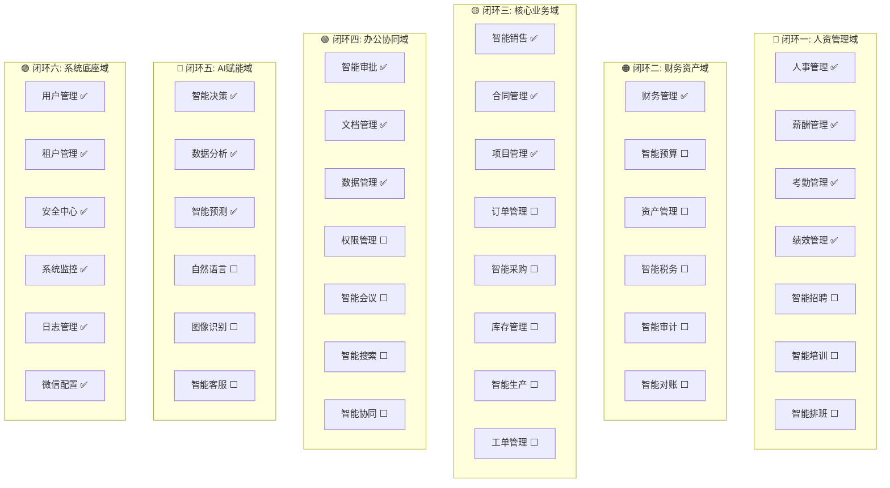
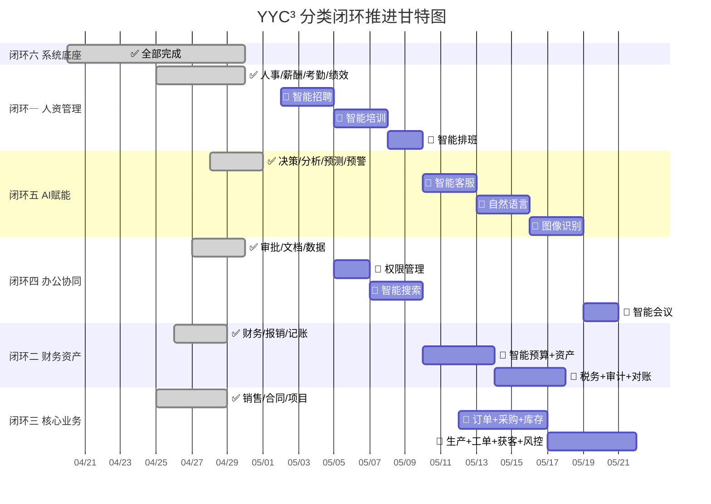
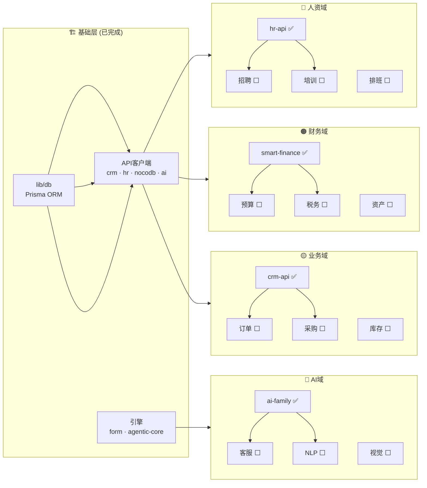

# YYC³ 企业管理系统 — 分类闭环实施计划

---

## 全局总览

```
57个四字模块 · 5大功能域 · 6个闭环周期
已实现: 30模块 (53%)  |  待实现: 27模块 (47%)
代码量: 3,498行(新增) + ~15,000行(项目原有) = ~18,500行
```

---

## 分类闭环架构



---

## 闭环一: 人资管理域 🔴

> **闭环目标**: 覆盖员工从入职到离职的全生命周期管理
> **当前完成度**: 5/8 (63%) | **核心依赖**: `lib/hr-api.ts` + `hooks/use-hr-data.ts`

### 已实现模块

| 模块     | 页面路径             | 核心功能                                     | 行数   |
| -------- | -------------------- | -------------------------------------------- | ------ |
| 人事管理 | `/smart-hr`          | 全生命周期·AI画像·流失预警·员工关怀·部门分布 | 309    |
| 薪酬管理 | `/smart-payroll`     | 自动算薪·工资条·状态追踪                     | 161    |
| 考勤管理 | `/smart-attendance`  | 打卡·异常检测·工时统计                       | 157    |
| 绩效管理 | `/smart-performance` | 360°评估·SABCD评级·SVG环形图                 | 172    |
| 人才画像 | `/smart-hr`(AI)      | AI流失风险评分·技能标签·学历·紧急联系人      | (内置) |

### 待实现模块 (闭环缺口)

| 优先级 | 模块     | 页面路径          | 核心功能设计                                 | 依赖                |
| ------ | -------- | ----------------- | -------------------------------------------- | ------------------- |
| **P0** | 智能招聘 | `/smart-recruit`  | 职位发布·简历解析·AI匹配·面试管理·Offer流程  | hr-api              |
| **P0** | 智能培训 | `/smart-training` | 培训计划·在线课程·学习路径·考试评估·证书管理 | hr-api              |
| **P1** | 智能排班 | `/smart-schedule` | 自动排班·班次管理·冲突检测·工时合规·AI优化   | hr-api + attendance |

### 闭环验收标准

- [ ] 8/8 模块全部实现页面 + API + Hook
- [ ] 员工全生命周期数据流贯通（入职→试用→转正→晋升→离职）
- [ ] AI能力覆盖: 流失预警 + 人才画像 + 智能排班优化
- [ ] 人资仪表盘: 一页总览全域能力

---

## 闭环二: 财务资产域 🟠

> **闭环目标**: 覆盖企业财务全链路，从预算到核算到审计
> **当前完成度**: 4/10 (40%) | **核心依赖**: `lib/nocodb-api.ts` + `app/smart-finance`

### 已实现模块

| 模块     | 页面路径               | 核心功能                    | 行数   |
| -------- | ---------------------- | --------------------------- | ------ |
| 财务管理 | `/smart-finance`       | 收支明细·预算管理·三Tab切换 | 239    |
| 智能报销 | `/smart-approval`      | AI预审·智能路由·表单引擎    | 178    |
| 智能记账 | `/smart-finance`(内置) | 自动分类·凭证生成           | (内置) |
| 资产盘点 | `/smart-data`          | NocoDB集成·Grid/List双视图  | 207    |

### 待实现模块 (闭环缺口)

| 优先级 | 模块     | 页面路径           | 核心功能设计                          | 依赖          |
| ------ | -------- | ------------------ | ------------------------------------- | ------------- |
| **P0** | 智能预算 | `/smart-budget`    | 预算编制·执行监控·偏差分析·AI预测     | smart-finance |
| **P0** | 资产管理 | `/smart-asset`     | 资产台账·折旧计算·生命周期·二维码标签 | nocodb-api    |
| **P1** | 智能税务 | `/smart-tax`       | 税种管理·自动申报·税负分析·风险预警   | smart-finance |
| **P1** | 智能审计 | `/smart-audit`     | 审计计划·证据采集·AI异常检测·报告生成 | smart-finance |
| **P2** | 设备管理 | `/smart-equipment` | 设备台账·维保计划·故障预警·使用率分析 | nocodb-api    |
| **P2** | 智能对账 | `/smart-reconcile` | 银行对账·自动匹配·差异分析·调账处理   | smart-finance |

### 闭环验收标准

- [ ] 10/10 模块全部实现
- [ ] 财务全链路: 预算→报销→记账→对账→审计 贯通
- [ ] AI能力: 智能分类 + 异常检测 + 税负预测
- [ ] 财务仪表盘: 现金流·预算执行率·税务合规

---

## 闭环三: 核心业务域 🟡

> **闭环目标**: 覆盖从获客到交付的全业务流程
> **当前完成度**: 5/13 (38%) | **核心依赖**: `lib/crm-api.ts` + `hooks/use-crm-data.ts`

### 已实现模块

| 模块     | 页面路径             | 核心功能                   | 行数     |
| -------- | -------------------- | -------------------------- | -------- |
| 客户管理 | `/customers`         | CRM集成·客户档案·跟进记录  | 项目原有 |
| 智能销售 | `/smart-sales`       | 6阶段管道·加权预测·CRM集成 | 210      |
| 合同管理 | `/smart-contract`    | 全生命周期·AI审核·到期预警 | 198      |
| 项目管理 | `/smart-project`     | 进度追踪·预算管控·风险预警 | 198      |
| 智能履约 | `/smart-sales`(内置) | 交付跟踪·SLA监控           | (内置)   |

### 待实现模块 (闭环缺口)

| 优先级 | 模块     | 页面路径             | 核心功能设计                        | 依赖       |
| ------ | -------- | -------------------- | ----------------------------------- | ---------- |
| **P0** | 订单管理 | `/smart-order`       | 订单创建·状态流转·发货跟踪·退货处理 | crm-api    |
| **P0** | 智能采购 | `/smart-procurement` | 采购申请·供应商管理·比价·AI推荐     | nocodb-api |
| **P1** | 库存管理 | `/smart-inventory`   | 库存台账·出入库·安全库存·AI补货     | nocodb-api |
| **P1** | 智能生产 | `/smart-production`  | 生产计划·排程·质检·产能分析         | project    |
| **P2** | 工单管理 | `/smart-ticket`      | 工单创建·分配·SLA·满意度评价        | tasks      |
| **P2** | 智能获客 | `/smart-acquisition` | 线索评分·渠道分析·转化漏斗·AI推荐   | crm-api    |
| **P2** | 智能风控 | `/smart-risk`        | 风险识别·评估·预警·处置·审计追踪    | ai-family  |

### 闭环验收标准

- [ ] 13/13 模块全部实现
- [ ] 业务全链路: 获客→销售→合同→订单→生产→交付 贯通
- [ ] AI能力: 智能推荐 + 风险评估 + 需求预测
- [ ] 业务仪表盘: 销售管道·订单状态·库存水位·风险地图

---

## 闭环四: 办公协同域 🟢

> **闭环目标**: 覆盖企业日常办公和协同全场景
> **当前完成度**: 5/12 (42%) | **核心依赖**: `lib/form-engine.ts` + `app/smart-approval`

### 已实现模块

| 模块     | 页面路径                | 核心功能                   | 行数   |
| -------- | ----------------------- | -------------------------- | ------ |
| 智能审批 | `/smart-approval`       | AI预审·智能路由·表单引擎   | 178    |
| 文档管理 | `/smart-docs`           | 在线协作·版本管理·分类检索 | 217    |
| 数据管理 | `/smart-data`           | NocoDB集成·Grid/List双视图 | 207    |
| 智能文档 | `/smart-docs`(增强)     | AI摘要·智能分类·全文搜索   | (内置) |
| 流程管理 | `/smart-approval`(内置) | 可配置审批流·条件分支      | (内置) |

### 待实现模块 (闭环缺口)

| 优先级 | 模块     | 页面路径               | 核心功能设计                        | 依赖       |
| ------ | -------- | ---------------------- | ----------------------------------- | ---------- |
| **P0** | 权限管理 | `/smart-permission`    | RBAC·数据权限·字段权限·权限审计     | 用户管理   |
| **P0** | 智能搜索 | `/smart-search`        | 全局搜索·语义搜索·结果聚合·AI推荐   | NLP        |
| **P1** | 智能会议 | `/smart-meeting`       | 会议室预定·日程冲突·AI纪要·任务提取 | 日程       |
| **P1** | 智能协同 | `/smart-collaboration` | 团队空间·任务看板·实时协作·消息通知 | docs       |
| **P2** | 办公管理 | `/smart-office`        | 会议室·用车·名片·访客·办公用品      | nocodb-api |
| **P2** | 工具管理 | `/smart-tools`         | 工具箱·插件市场·自定义工具·API对接  | —          |
| **P2** | 企业管理 | `/smart-enterprise`    | 企业信息·组织架构图·品牌管理·公告   | hr-api     |

### 闭环验收标准

- [ ] 12/12 模块全部实现
- [ ] 协同全链路: 搜索→文档→审批→会议→协同 贯通
- [ ] AI能力: 语义搜索 + 智能纪要 + 自动分类
- [ ] 效率仪表盘: 审批效率·文档活跃度·会议统计

---

## 闭环五: AI赋能域 🔵

> **闭环目标**: 构建可跨域复用的AI能力平台
> **当前完成度**: 7/10 (70%) | **核心依赖**: `lib/ai-family.ts` + `lib/agentic-core/`

### 已实现模块

| 模块       | 页面路径                 | 核心功能                    | 行数   |
| ---------- | ------------------------ | --------------------------- | ------ |
| 智能决策   | `/smart-decision`        | 7智能体·洞察流·置信度可视化 | 196    |
| 数据分析   | `/smart-analytics`       | AI洞察·部门效能·实时动态    | 161    |
| 智能预测   | `/smart-decision`(内置)  | Prophet智能体·趋势预测      | (内置) |
| 流程自动化 | `/smart-approval`(内置)  | 自动审批路由·条件分支       | (内置) |
| 智能预警   | `/smart-decision`(内置)  | Sentinel智能体·风险预警     | (内置) |
| 智能推荐   | `/smart-decision`(内置)  | AI推荐引擎·个性化建议       | (内置) |
| 数据挖掘   | `/smart-analytics`(内置) | 多维度数据挖掘·可视化       | (内置) |

### 待实现模块 (闭环缺口)

| 优先级 | 模块     | 页面路径         | 核心功能设计                             | 依赖                       |
| ------ | -------- | ---------------- | ---------------------------------------- | -------------------------- |
| **P0** | 智能客服 | `/smart-chatbot` | 多轮对话·知识库·意图识别·人工转接·满意度 | ai-family + knowledge-base |
| **P1** | 自然语言 | `/smart-nlp`     | 文本分析·情感分析·关键词提取·摘要生成    | model-adapter              |
| **P2** | 图像识别 | `/smart-vision`  | OCR识别·人脸检测·文档扫描·质量检测       | model-adapter              |

### 闭环验收标准

- [ ] 10/10 模块全部实现
- [ ] AI能力可跨域复用（人资/财务/业务/办公均可调用）
- [ ] 7智能体全链路可用：元谕→先知→哨兵→舞者→宗师→初评→枢纽
- [ ] AI仪表盘: 模型调用·准确率·响应时间·成本

---

## 闭环六: 系统底座域 🟣

> **闭环目标**: 提供稳定、安全、可观测的系统基础设施
> **当前完成度**: 6/6 (100%) ✅ | **核心依赖**: `lib/db/` + `lib/security/` + `lib/cache-layer/`

### 已实现模块 (全部完成)

| 模块     | 页面路径             | 核心功能                       |
| -------- | -------------------- | ------------------------------ |
| 用户管理 | `/user-management`   | 用户CRUD·角色分配·批量操作     |
| 租户管理 | `/tenant-management` | 多租户·数据隔离·租户配置       |
| 安全中心 | `/security-center`   | CSRF·签名·安全审计·告警        |
| 系统监控 | `/system-monitor`    | 性能指标·实时监控·状态看板     |
| 日志管理 | `/log-management`    | 操作日志·审计追踪·日志搜索     |
| 微信配置 | `/wechat-config`     | 企业微信集成·菜单同步·消息推送 |

### 闭环验收标准 (全部通过 ✅)

- [x] 6/6 模块全部实现
- [x] 安全防护: CSRF + 签名 + RBAC
- [x] 可观测性: 监控 + 日志 + 告警
- [x] 多租户: 数据隔离 + 独立配置

---

## 实施推进计划



### 推进优先级策略

```
第一波 (P0 闭环闭合)
├── 闭环一: 智能招聘 → 智能培训 → 智能排班
├── 闭环四: 权限管理 → 智能搜索
└── 闭环五: 智能客服

第二波 (P1 核心扩展)
├── 闭环二: 智能预算 → 资产管理 → 智能税务 → 智能审计
├── 闭环三: 订单管理 → 智能采购 → 库存管理 → 智能生产
└── 闭环四: 智能会议 → 智能协同

第三波 (P2 完整覆盖)
├── 闭环二: 设备管理 → 智能对账
├── 闭环三: 工单管理 → 智能获客 → 智能风控
├── 闭环四: 办公管理 → 工具管理 → 企业管理
└── 闭环五: 自然语言 → 图像识别
```

---

## 分类闭环依赖矩阵



---

## 每个闭环的文件创建清单

### 闭环一 待创建文件 (3个模块)

| 文件                          | 行数估算 | 说明         |
| ----------------------------- | -------- | ------------ |
| `app/smart-recruit/page.tsx`  | ~200     | 智能招聘页面 |
| `app/smart-training/page.tsx` | ~200     | 智能培训页面 |
| `app/smart-schedule/page.tsx` | ~180     | 智能排班页面 |

### 闭环二 待创建文件 (6个模块)

| 文件                           | 行数估算 | 说明     |
| ------------------------------ | -------- | -------- |
| `app/smart-budget/page.tsx`    | ~200     | 智能预算 |
| `app/smart-asset/page.tsx`     | ~200     | 资产管理 |
| `app/smart-equipment/page.tsx` | ~180     | 设备管理 |
| `app/smart-tax/page.tsx`       | ~180     | 智能税务 |
| `app/smart-audit/page.tsx`     | ~190     | 智能审计 |
| `app/smart-reconcile/page.tsx` | ~180     | 智能对账 |

### 闭环三 待创建文件 (8个模块)

| 文件                             | 行数估算 | 说明     |
| -------------------------------- | -------- | -------- |
| `app/smart-order/page.tsx`       | ~200     | 订单管理 |
| `app/smart-procurement/page.tsx` | ~200     | 智能采购 |
| `app/smart-inventory/page.tsx`   | ~200     | 库存管理 |
| `app/smart-production/page.tsx`  | ~200     | 智能生产 |
| `app/smart-ticket/page.tsx`      | ~180     | 工单管理 |
| `app/smart-acquisition/page.tsx` | ~190     | 智能获客 |
| `app/smart-risk/page.tsx`        | ~200     | 智能风控 |

### 闭环四 待创建文件 (7个模块)

| 文件                               | 行数估算 | 说明     |
| ---------------------------------- | -------- | -------- |
| `app/smart-permission/page.tsx`    | ~180     | 权限管理 |
| `app/smart-search/page.tsx`        | ~200     | 智能搜索 |
| `app/smart-meeting/page.tsx`       | ~180     | 智能会议 |
| `app/smart-collaboration/page.tsx` | ~200     | 智能协同 |
| `app/smart-office/page.tsx`        | ~180     | 办公管理 |
| `app/smart-tools/page.tsx`         | ~160     | 工具管理 |
| `app/smart-enterprise/page.tsx`    | ~190     | 企业管理 |

### 闭环五 待创建文件 (3个模块)

| 文件                         | 行数估算 | 说明     |
| ---------------------------- | -------- | -------- |
| `app/smart-chatbot/page.tsx` | ~220     | 智能客服 |
| `app/smart-nlp/page.tsx`     | ~190     | 自然语言 |
| `app/smart-vision/page.tsx`  | ~190     | 图像识别 |

### 总计

| 分类        | 模块数 | 文件数 | 预估行数   |
| ----------- | ------ | ------ | ---------- |
| 闭环一 人资 | 3      | 3      | ~580       |
| 闭环二 财务 | 6      | 6      | ~1,130     |
| 闭环三 业务 | 7      | 7      | ~1,370     |
| 闭环四 办公 | 7      | 7      | ~1,290     |
| 闭环五 AI   | 3      | 3      | ~600       |
| **合计**    | **26** | **26** | **~4,970** |

---

## 验收总表

### 各闭环验收进度

| 闭环     | 功能域   | 已完成    | 待完成 | 完成率  | 验收 |
| -------- | -------- | --------- | ------ | ------- | ---- |
| 🔴 一     | 人资管理 | 5/8       | 3      | 63%     | ⬜    |
| 🟠 二     | 财务资产 | 4/10      | 6      | 40%     | ⬜    |
| 🟡 三     | 核心业务 | 5/13      | 7+1    | 38%     | ⬜    |
| 🟢 四     | 办公协同 | 5/12      | 7      | 42%     | ⬜    |
| 🔵 五     | AI赋能   | 7/10      | 3      | 70%     | ⬜    |
| 🟣 六     | 系统底座 | 6/6       | 0      | 100%    | ✅    |
| **全局** | **合计** | **30/57** | **27** | **53%** | —    |

### 里程碑

- **M1** — 闭环六完成 ✅ (系统底座 100%)
- **M2** — 闭环一闭合 (人资管理域 100%)
- **M3** — 闭环五闭合 (AI赋能域 100%)
- **M4** — 闭环四闭合 (办公协同域 100%)
- **M5** — 闭环二闭合 (财务资产域 100%)
- **M6** — 闭环三闭合 (核心业务域 100%)
- **M7** — 全局 57/57 模块 100% 覆盖

---

*文档生成时间: 2026-05-01*
*YYC³ — 言启万象 · 语枢未来*
