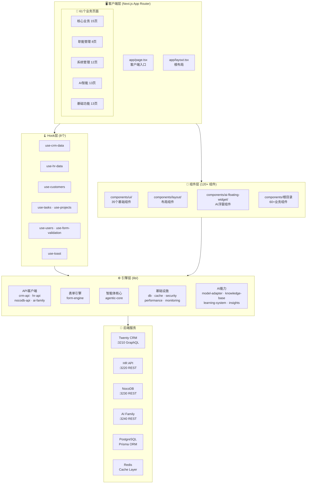
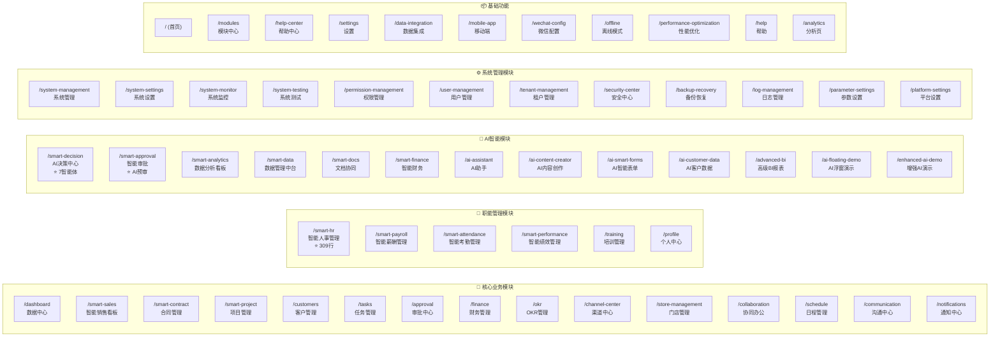
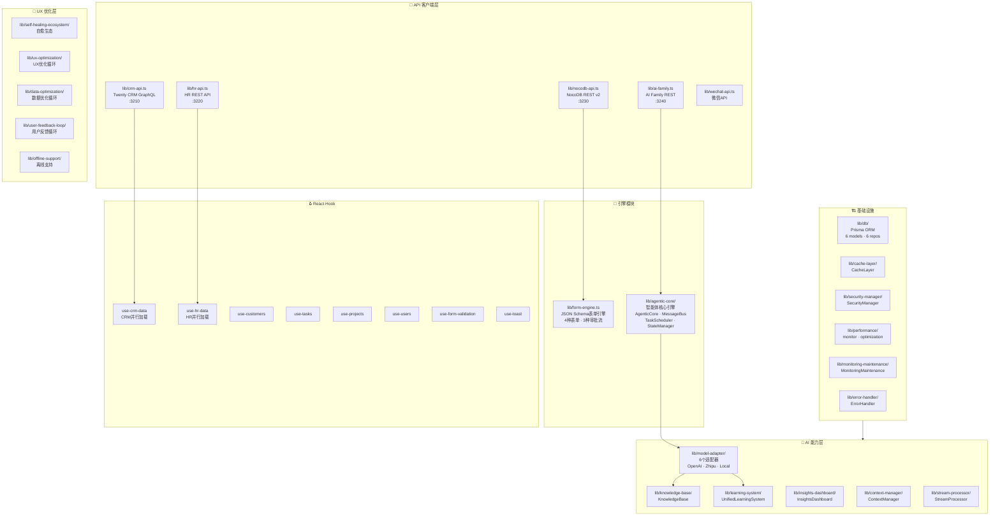
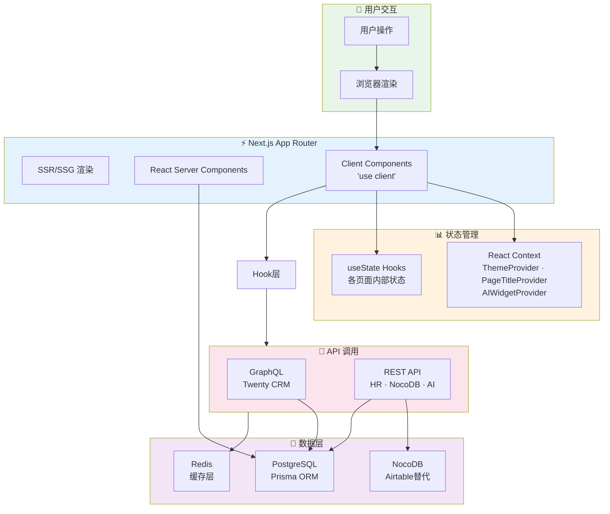
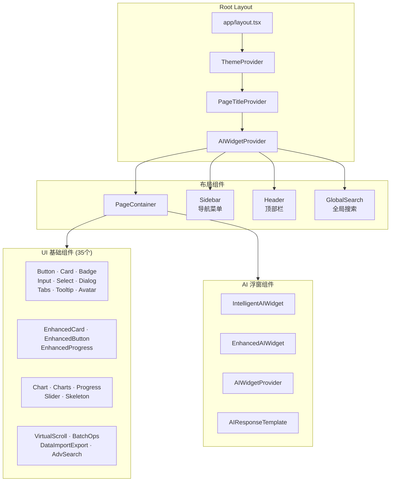
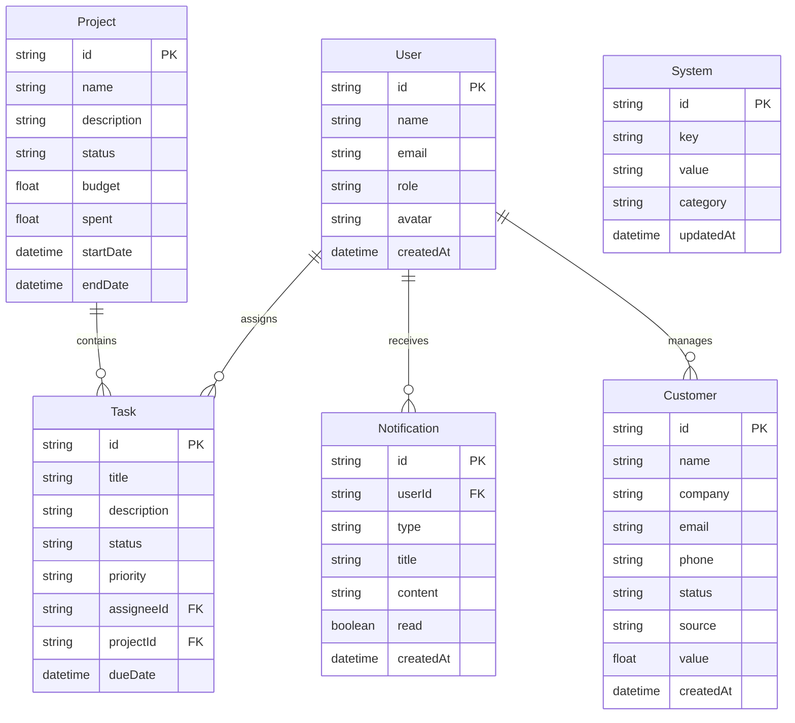
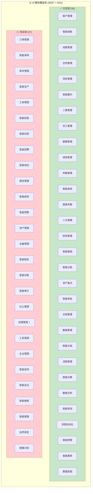
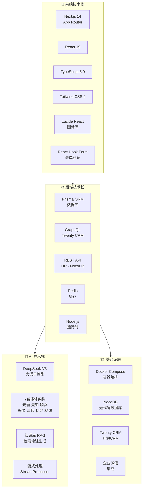
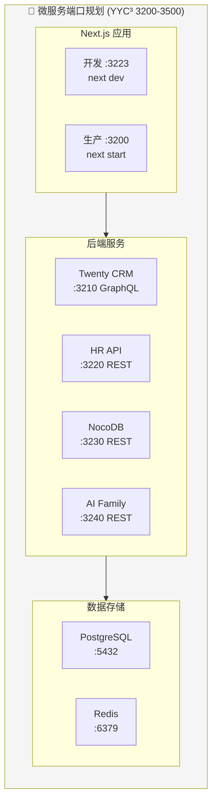

# YYC³ 企业管理系统 — 可视化架构文档

---

## 一、系统总览架构



---

## 二、页面功能模块全景



---

## 三、引擎层模块依赖关系



---

## 四、数据流架构



---

## 五、组件层级结构



---

## 六、数据库模型结构



---

## 七、模块覆盖率热力图



> ⚡ 权限管理已有页面 `/permission-management` 但功能待完善

---

## 八、技术栈全景



---

## 九、目录结构树

```
yyc3-mana/
├── app/                          # 61个页面 (Next.js App Router)
│   ├── page.tsx                  # 首页
│   ├── layout.tsx                # 根布局
│   ├── smart-hr/                 # ⭐ 智能人事管理 (309行)
│   ├── smart-sales/              # ⭐ 智能销售看板 (210行)
│   ├── smart-decision/           # ⭐ AI决策中心 (196行)
│   ├── smart-finance/            # ⭐ 智能财务管理 (239行)
│   ├── smart-data/               # ⭐ 数据管理中台 (207行)
│   ├── smart-docs/               # ⭐ 文档协同 (217行)
│   ├── smart-contract/           # ⭐ 合同管理 (198行)
│   ├── smart-project/            # ⭐ 项目管理 (198行)
│   ├── smart-approval/           # ⭐ 智能审批 (178行)
│   ├── smart-analytics/          # ⭐ 数据分析看板 (161行)
│   ├── smart-payroll/            # ⭐ 薪酬管理 (161行)
│   ├── smart-performance/        # ⭐ 绩效管理 (172行)
│   ├── smart-attendance/         # ⭐ 考勤管理 (157行)
│   ├── dashboard/                # 数据中心
│   ├── customers/                # 客户管理
│   ├── tasks/                    # 任务管理
│   ├── projects/                 # 项目管理
│   ├── ...                       # (47个其他页面)
│   └── wechat-config/            # 微信配置
│
├── components/                   # 120+ 组件
│   ├── ui/                       # 35个基础UI组件
│   │   ├── enhanced-card.tsx     # 增强卡片
│   │   ├── enhanced-button.tsx   # 增强按钮
│   │   ├── chart.tsx             # 图表
│   │   └── ...                   # (31个其他UI组件)
│   ├── layout/                   # 布局组件
│   │   └── page-container.tsx    # 页面容器
│   ├── ai-floating-widget/       # AI浮窗组件
│   │   ├── AIWidgetProvider.tsx  # 浮窗状态管理
│   │   ├── IntelligentAIWidget.tsx # 智能浮窗
│   │   ├── EnhancedAIWidget.tsx  # 增强浮窗
│   │   └── AIResponseTemplate.tsx # 响应模板
│   ├── sidebar.tsx               # 侧边栏导航
│   ├── header.tsx                # 顶部栏
│   ├── global-search.tsx         # 全局搜索
│   └── ...                       # (60+业务组件)
│
├── lib/                          # 80+ 引擎模块
│   ├── crm-api.ts                # ⭐ Twenty CRM GraphQL客户端
│   ├── hr-api.ts                 # ⭐ HR REST API客户端
│   ├── nocodb-api.ts             # ⭐ NocoDB REST v2客户端
│   ├── form-engine.ts            # ⭐ JSON Schema表单引擎
│   ├── ai-family.ts              # ⭐ AI Family 7智能体
│   ├── agentic-core/             # 智能体核心引擎
│   │   ├── AgenticCore.ts        # 核心引擎 (SimpleEventEmitter)
│   │   ├── MessageBus.ts         # 消息总线
│   │   ├── TaskScheduler.ts      # 任务调度器
│   │   └── StateManager.ts       # 状态管理器
│   ├── model-adapter/            # AI模型适配器
│   │   ├── OpenAIAdapter.ts      # OpenAI适配
│   │   ├── ZhipuAdapter.ts       # 智谱适配
│   │   ├── LocalModelAdapter.ts  # 本地模型适配
│   │   └── ModelRouter.ts        # 模型路由
│   ├── db/                       # 数据库层
│   │   ├── models/               # Prisma模型 (6个)
│   │   └── repositories/         # 数据仓库 (6个)
│   ├── self-healing-ecosystem/   # 自愈生态
│   ├── knowledge-base/           # 知识库
│   ├── learning-system/          # 学习系统
│   ├── cache-layer/              # 缓存层
│   ├── security-manager/         # 安全管理
│   └── ...                       # (60+其他模块)
│
├── hooks/                        # 8个React Hook
│   ├── use-crm-data.ts           # ⭐ CRM数据Hook
│   ├── use-hr-data.ts            # ⭐ HR数据Hook
│   ├── use-customers.ts          # 客户数据Hook
│   ├── use-tasks.ts              # 任务数据Hook
│   ├── use-projects.ts           # 项目数据Hook
│   ├── use-users.ts              # 用户数据Hook
│   ├── use-form-validation.ts    # 表单验证Hook
│   └── use-toast.ts              # Toast通知Hook
│
├── contexts/                     # React Context
│   └── page-title-context.tsx    # 页面标题上下文
│
└── docs/                         # 文档
    ├── YYC³企业管理系统-智能模块集成衔接文档.md
    └── 企业管理系统.md             # 57模块规格书
```

---

## 十、端口与服务映射



---

*文档生成时间: 2026-05-01*
*YYC³ — 言启万象 · 语枢未来*
